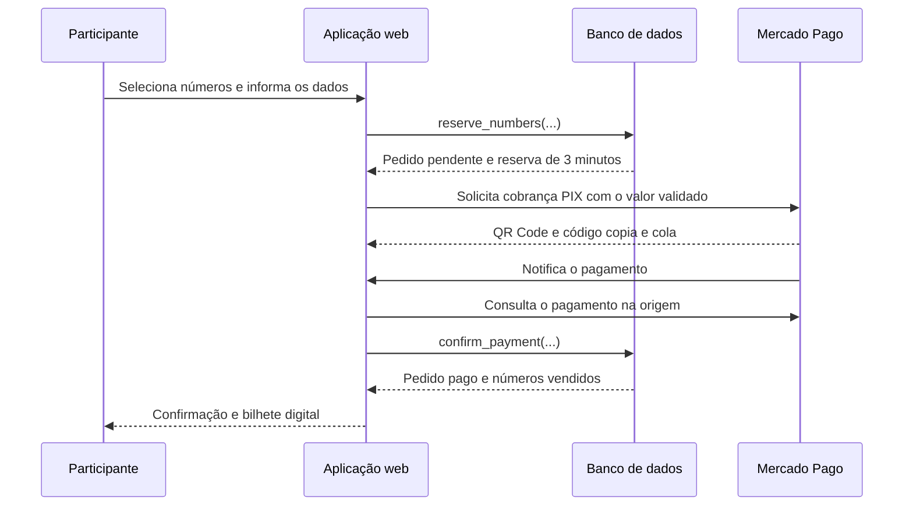

# Rifa Solidária — Associação Reviva Brasil

Plataforma web para criação, divulgação, venda e gestão de rifas solidárias da Associação Reviva Brasil. O sistema reúne campanhas públicas, seleção de números, promoções por quantidade, pagamentos PIX, comprovantes, ranking de vendedores, sorteios e uma área administrativa.

**Endereço oficial:** [https://rifa.revivabrasil.com.br](https://rifa.revivabrasil.com.br)

## Documentação

| Documento | Conteúdo |
| --- | --- |
| [Arquitetura](docs/ARQUITETURA.md) | Organização do aplicativo, rotas, módulos, integrações e fluxos de execução |
| [Banco de dados](docs/BANCO-DE-DADOS.md) | Modelo relacional, regras transacionais, funções, segurança e migrações |
| [Design System](docs/DESIGN-SYSTEM.md) | Identidade visual, tokens, componentes, responsividade e acessibilidade |

## Visão do produto

A plataforma atende três jornadas principais:

1. **Participante:** encontra uma campanha, escolhe números, informa seus dados, paga por PIX e recebe um bilhete digital.
2. **Vendedor:** é associado opcionalmente às compras e participa do ranking da campanha.
3. **Administrador:** cria e edita campanhas, acompanha pedidos, emite segundas vias, administra promoções, realiza sorteios e consulta rankings.

## Recursos principais

### Experiência pública

- Página inicial institucional com campanhas ativas.
- Página própria por campanha em `/campanha/:slug`.
- Grade responsiva com números disponíveis, reservados e vendidos.
- Atualização da grade em tempo real.
- Reserva atômica dos números por três minutos.
- Promoções por quantidade exata, como “3 números por R$ 50,00”.
- Checkout PIX integrado ao Mercado Pago.
- Confirmação automática após aprovação do pagamento.
- Bilhete comprovante em imagem, disponível para download ou compartilhamento.
- Compartilhamento da campanha por WhatsApp, e-mail, recursos nativos e cópia de texto.
- Ranking público agregado, sem exposição dos dados dos compradores.
- Página única de informações com âncoras para Quem Somos, Como Funciona, Termos, Privacidade e Segurança.

### Administração

- Autenticação por e-mail e senha, com autorização vinculada a administradores cadastrados.
- Painel com indicadores de campanhas, arrecadação, vendas e compradores.
- Cadastro e edição completa de campanhas.
- Quantidade configurável entre 100 e 1.000 números.
- Meta calculada a partir da quantidade e do preço regular.
- Cadastro de prêmios, imagens, regulamento e dados complementares.
- Cadastro de múltiplas faixas promocionais por quantidade exata.
- Gestão dos estados da campanha: rascunho, ativa, pausada, finalizada, sorteada ou cancelada.
- Relatório de pedidos com comprador, números adquiridos, valor e situação.
- Confirmação ou cancelamento administrativo de pedidos.
- Emissão de segunda via do bilhete para pedidos pagos.
- Exportação do ranking em PDF.
- Sorteador gamificado restrito aos números efetivamente vendidos.
- Ranking completo de vendedores com celebração do melhor resultado.

## Tecnologias

| Camada | Tecnologia |
| --- | --- |
| Aplicação | React 19, TypeScript e TanStack Start |
| Navegação | TanStack Router com rotas baseadas em arquivos |
| Estado assíncrono | TanStack Query e cliente da Lovable Cloud |
| Interface | Tailwind CSS 4, componentes Radix UI e variantes Shadcn |
| Formulários | React Hook Form e Zod |
| Animações | Framer Motion e canvas-confetti |
| Documentos | html-to-image, jsPDF e jsPDF AutoTable |
| Backend | Lovable Cloud: PostgreSQL, autenticação, storage e atualizações em tempo real |
| Pagamentos | API PIX do Mercado Pago e webhook de confirmação |
| Build e entrega | Vite 7 e runtime serverless compatível com Edge |

## Estrutura resumida

```text
.
├── docs/
│   ├── ARQUITETURA.md
│   ├── BANCO-DE-DADOS.md
│   ├── DESIGN-SYSTEM.md
│   └── migrations/               # Cópias históricas iniciais
├── src/
│   ├── assets/                   # Logos, banner e imagens registradas
│   ├── components/               # Componentes de domínio e biblioteca visual
│   ├── hooks/                    # Hooks de sessão e responsividade
│   ├── integrations/             # Clientes e tipos gerados da Lovable Cloud
│   ├── lib/                      # Regras de preço, formatação e funções de servidor
│   ├── routes/                   # Páginas, webhook público e manutenção interna do PIX
│   ├── router.tsx                # Instância do roteador
│   ├── server.ts                 # Entrada SSR e tratamento de falhas
│   ├── start.ts                  # Middlewares da aplicação
│   └── styles.css                # Tokens e animações globais
├── supabase/
│   ├── migrations/               # Histórico versionado do banco
│   └── complete_schema.sql       # Referência da estrutura-base
├── package.json
└── vite.config.ts
```

> `src/routeTree.gen.ts` e os arquivos em `src/integrations/supabase/` são gerados ou gerenciados pela plataforma e não devem ser editados manualmente.

## Como executar localmente

### Pré-requisitos

- Bun compatível com o arquivo de lock do projeto.
- Projeto conectado à Lovable Cloud.
- Variáveis públicas e privadas configuradas no ambiente apropriado.

### Instalação e execução

```bash
bun install
bun run dev
```

O servidor de desenvolvimento utiliza a configuração fornecida pela plataforma. Para gerar uma versão de produção:

```bash
bun run build
```

Para validar o código:

```bash
bun run lint
```

## Configuração de ambiente

Nunca grave credenciais no repositório. As variáveis privadas devem existir apenas no ambiente de execução.

| Variável | Escopo | Finalidade |
| --- | --- | --- |
| `VITE_SUPABASE_URL` | Navegador | Endereço público do backend gerenciado |
| `VITE_SUPABASE_PUBLISHABLE_KEY` | Navegador | Chave pública para operações sujeitas às políticas de acesso |
| `SUPABASE_URL` | Servidor | Endereço do backend usado pelas funções de servidor |
| `SUPABASE_SERVICE_ROLE_KEY` | Servidor | Operações privilegiadas estritamente controladas |
| `ACCESS_TOKEN` | Servidor | Credencial da API do Mercado Pago |
| `APP_BASE_URL` | Servidor | Origem pública usada para compor a URL do webhook |

## Fluxo de compra



O preço exibido no navegador é apenas uma prévia. O valor definitivo é calculado por `reserve_numbers` no banco, inclusive quando existe uma promoção ativa para a quantidade exata selecionada. O checkout e o Mercado Pago utilizam o valor persistido no pedido.

## Segurança e privacidade

- As tabelas usam Row Level Security e permissões explícitas.
- Dados pessoais de compradores e detalhes internos de pedidos não são expostos por consultas públicas diretas.
- O painel exige sessão autenticada e presença na tabela administrativa.
- Reservas e confirmações importantes são executadas por funções transacionais do banco.
- Funções de servidor validam identificadores com Zod antes de consultar dados privados.
- O webhook oficial em `/api/public/webhooks/mercadopago` confirma o estado do pagamento consultando a API do Mercado Pago antes de alterar o pedido.
- A manutenção protegida do PIX roda a cada minuto, encerra reservas vencidas mesmo com a tela fechada e encaminha pagamentos tardios para estorno.
- Credenciais privadas ficam somente no ambiente do servidor.

Consulte [Banco de dados — Segurança](docs/BANCO-DE-DADOS.md#segurança-e-controle-de-acesso) para a matriz de acesso e [Arquitetura — Pontos de atenção](docs/ARQUITETURA.md#pontos-de-atenção-e-evolução) para limites conhecidos.

## Convenções de manutenção

1. Toda mudança estrutural no banco deve ser criada como uma nova migração em `supabase/migrations/`.
2. Toda nova tabela pública precisa de permissões explícitas, RLS e políticas no mesmo arquivo de migração.
3. O preço final deve continuar sendo calculado no banco, nunca confiado ao navegador.
4. Dados privados devem permanecer atrás das políticas administrativas ou de funções de servidor com retorno mínimo.
5. Novas páginas devem seguir a navegação por arquivos do TanStack Router e declarar metadados próprios.
6. Novos elementos visuais devem reutilizar tokens e componentes descritos no [Design System](docs/DESIGN-SYSTEM.md).
7. Antes de publicar, validar build, fluxo público, autenticação administrativa, PIX, confirmação, bilhete e visualizações móveis.

## Publicação e operação

- O domínio oficial de divulgação é `https://rifa.revivabrasil.com.br`.
- Links compartilhados devem usar o domínio oficial e o slug da campanha.
- A URL de retorno do Mercado Pago é derivada de `APP_BASE_URL`.
- O histórico do banco é mantido em `supabase/migrations/`; não altere migrações já aplicadas.
- Logs de geração de PIX e processamento do webhook são emitidos no servidor para diagnóstico.
- O estado da grade é distribuído em tempo real a partir de alterações em `raffle_numbers`.

## Propriedade e licença

Software de uso interno da **Associação Reviva Brasil**. Todos os direitos reservados. Distribuição, reutilização ou publicação do código dependem de autorização formal da organização.
