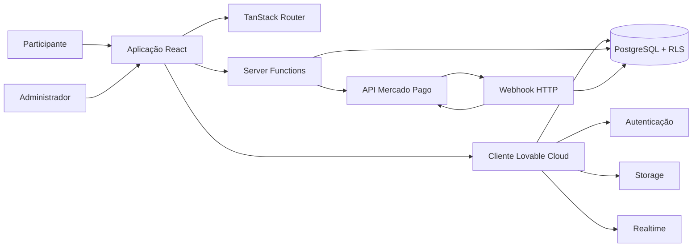
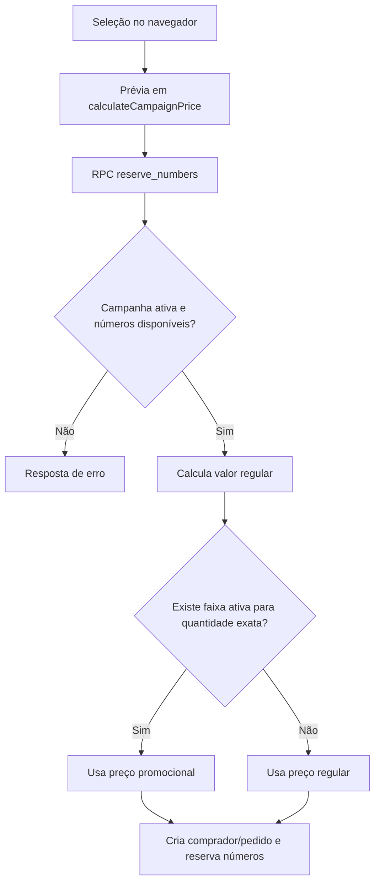

# Arquitetura da Aplicação

## 1. Objetivo e escopo

Este documento descreve a arquitetura técnica da plataforma **Rifa Solidária**, cobrindo a aplicação React, a camada server-side, a integração com a Lovable Cloud, o Mercado Pago e os principais fluxos de negócio. O conteúdo reflete o estado atual do repositório em setembro de 2026.

Para detalhes relacionais e políticas de acesso, consulte [BANCO-DE-DADOS.md](BANCO-DE-DADOS.md). Para padrões visuais, consulte [DESIGN-SYSTEM.md](DESIGN-SYSTEM.md).

## 2. Visão arquitetural

A solução é uma aplicação full-stack única. O navegador renderiza as jornadas públicas e administrativas; o TanStack Start fornece SSR, rotas, funções de servidor e o endpoint HTTP; a Lovable Cloud fornece autenticação, PostgreSQL, storage e atualizações em tempo real.



### Princípios adotados

- **Rotas baseadas em arquivos:** cada página ou endpoint é representado em `src/routes/`.
- **Banco como autoridade transacional:** disponibilidade, reserva e preço definitivo são validados no PostgreSQL.
- **Defesa por camadas:** autenticação no cliente, RLS no banco e credenciais privadas somente no servidor.
- **Separação público/administrativo:** consultas públicas têm projeções mínimas; operações de gestão exigem autorização.
- **Componentes reutilizáveis:** cabeçalho, rodapé, modais, ranking, comprovante e controles administrativos são compartilhados.
- **Progressive enhancement:** download do bilhete funciona em desktop; compartilhamento nativo é usado quando o dispositivo oferece suporte.

## 3. Stack e responsabilidades

| Tecnologia | Responsabilidade |
| --- | --- |
| React 19 | Composição da interface e estado local |
| TypeScript | Contratos estáticos entre páginas, componentes e dados |
| TanStack Start | SSR, funções de servidor e integração de execução |
| TanStack Router | Árvore de rotas, parâmetros e navegação tipada |
| TanStack Query | Contexto de consultas e base para cache assíncrono |
| Vite 7 | Desenvolvimento e empacotamento |
| Tailwind CSS 4 | Tokens, utilitários e layout responsivo |
| Radix UI | Primitivas acessíveis de diálogo, menu, sheet e controles |
| Lovable Cloud | Banco, autenticação, storage e Realtime |
| Zod | Validação das entradas das funções de servidor |
| Mercado Pago | Criação e confirmação das cobranças PIX |
| html-to-image | Renderização do bilhete como PNG |
| jsPDF | Exportação administrativa do ranking |
| Framer Motion | Transições das experiências gamificadas |
| canvas-confetti | Celebrações após pagamento, sorteio e ranking |

## 4. Inicialização e ciclo de execução

### 4.1 Build e servidor

- `vite.config.ts` utiliza a configuração oficial do TanStack Start fornecida pela plataforma e aponta a entrada do servidor para `src/server.ts`.
- `src/server.ts` carrega a entrada SSR sob demanda e normaliza falhas catastróficas em uma página HTML controlada.
- `src/start.ts` registra dois middlewares:
  - envio da sessão da Lovable Cloud às funções de servidor;
  - captura de exceções não tratadas e resposta HTML de erro.
- `src/router.tsx` cria uma instância de `QueryClient`, configura restauração de rolagem e injeta o contexto no roteador.
- `src/routeTree.gen.ts` é gerado automaticamente e não deve ser editado.

### 4.2 Layout raiz

`src/routes/__root.tsx` define:

- metadados globais, idioma `pt-BR`, favicon e fontes;
- `QueryClientProvider`;
- aviso de configuração, cabeçalho, conteúdo da rota e rodapé;
- notificações globais pelo Sonner;
- páginas padronizadas de erro e conteúdo não encontrado.

## 5. Organização do código

```text
src/
├── assets/                 Recursos visuais registrados no projeto
├── components/
│   ├── admin/              Controles específicos da gestão
│   └── ui/                 Biblioteca base de componentes
├── hooks/                  Sessão administrativa e utilitários React
├── integrations/supabase/  Cliente, middlewares e tipos gerados
├── lib/
│   ├── api/                Funções de servidor chamadas pelo navegador
│   ├── mercadopago.server.ts
│   ├── promotions.ts
│   ├── format.ts
│   └── error-*.ts
├── routes/                 Páginas e endpoint HTTP
├── router.tsx
├── server.ts
├── start.ts
└── styles.css
```

### Limites entre módulos

- **Componentes:** apresentação e interações locais; podem consultar o cliente público quando a política do banco permite.
- **Rotas:** orquestram carregamento, estado da página e navegação.
- **Funções de servidor:** usam segredos e retornam apenas os dados necessários para a jornada.
- **Módulos `.server.ts`:** concentram integrações que nunca devem entrar no pacote do navegador.
- **Banco:** executa regras que precisam ser atômicas ou imunes à adulteração do cliente.

## 6. Mapa de rotas

### 6.1 Rotas públicas

| Caminho | Arquivo | Responsabilidade |
| --- | --- | --- |
| `/` | `src/routes/index.tsx` | Página inicial, identidade e campanhas ativas |
| `/campanha/:slug` | `src/routes/campanha.$slug.tsx` | Campanha, prêmios, ofertas, grade e reserva |
| `/checkout/:orderId` | `src/routes/checkout.$orderId.tsx` | Geração PIX, contador, cancelamento e espera |
| `/confirmacao/:orderId` | `src/routes/confirmacao.$orderId.tsx` | Agradecimento e emissão do bilhete |
| `/informacoes` | `src/routes/informacoes.tsx` | Conteúdo institucional e legal com âncoras |

### 6.2 Rotas administrativas

| Caminho | Arquivo | Responsabilidade |
| --- | --- | --- |
| `/admin` | `src/routes/admin.tsx` | Layout, navegação e proteção da área |
| `/admin/login` | `src/routes/admin.login.tsx` | Entrada administrativa |
| `/admin/dashboard` | `src/routes/admin.dashboard.tsx` | Indicadores gerais |
| `/admin/campaigns` | `src/routes/admin.campaigns.index.tsx` | Listagem de campanhas |
| `/admin/campaigns/new` | `src/routes/admin.campaigns.new.tsx` | Criação de campanha e promoções |
| `/admin/campaigns/:id` | `src/routes/admin.campaigns.$id.tsx` | Edição, pedidos, relatórios e segunda via |
| `/admin/draw` | `src/routes/admin.draw.index.tsx` | Seleção de campanha para sorteio |
| `/admin/draw/:id` | `src/routes/admin.draw.$id.tsx` | Sorteador gamificado |
| `/admin/ranking` | `src/routes/admin.ranking.index.tsx` | Seleção de campanha para ranking |
| `/admin/ranking/:id` | `src/routes/admin.ranking.$id.tsx` | Ranking completo e melhor vendedor |

### 6.3 Endpoint HTTP

| Método e caminho | Arquivo | Responsabilidade |
| --- | --- | --- |
| `POST /api/public/webhooks/mercadopago` | `src/routes/api.public.webhooks.mercadopago.ts` | Receber notificação, consultar o pagamento no provedor e confirmar o pedido |

## 7. Componentes de domínio

| Componente | Função |
| --- | --- |
| `Header` | Navegação pública, identidade e acesso administrativo em desktop/mobile |
| `Footer` | Identidade institucional, projetos apoiados e links informativos |
| `BuyerModal` | Coleta os dados necessários antes da reserva |
| `ShareCampaign` | Monta e distribui o convite da campanha |
| `SellerRanking` | Consulta e mostra a classificação pública agregada |
| `ReceiptTicket` | Representação visual do comprovante |
| `ReceiptDownloadButton` | Gera segunda via no painel administrativo |
| `ImageUpload` | Envia imagens de campanha ao storage |
| `PromotionEditor` | Cadastra e valida faixas promocionais |

Componentes genéricos residem em `src/components/ui/` e devem ser preferidos em novos controles para manter comportamento, foco e aparência consistentes.

## 8. Fluxos funcionais

### 8.1 Descoberta e seleção

1. A página inicial consulta campanhas ativas.
2. A página da campanha consulta seus dados, números, prêmios e promoções.
3. Imagens armazenadas no backend recebem URLs assinadas quando necessário.
4. O navegador assina alterações de `raffle_numbers` e atualiza a grade em tempo real.
5. Somente números com estado `available` podem ser selecionados.

### 8.2 Reserva e preço promocional



`src/lib/promotions.ts` replica a regra para feedback imediato, mas não é a fonte de autoridade. A função SQL `reserve_numbers` recalcula o valor, mantém `list_amount`, registra a faixa aplicada e impede reserva concorrente dos mesmos números.

### 8.3 Pagamento PIX

1. `/checkout/:orderId` chama `getOrderPublic` para obter uma projeção segura do pedido.
2. `getOrGeneratePix` consulta o pedido com credenciais do servidor.
3. Se existir PIX válido para o pedido pendente, ele é reutilizado.
4. Caso contrário, `createPixPaymentRecord` envia o valor persistido à API do Mercado Pago.
5. O QR Code, o código copia e cola e o identificador externo são gravados no pedido.
6. A cobrança e a reserva vencem juntas após 180 segundos, com horário salvo pelo servidor.
7. A tela consulta o pedido a cada 1,5 segundo e navega imediatamente quando encontra `paid`.
8. Se a reserva zerar sem pagamento, o participante volta à campanha para iniciar um novo pedido.

### 8.4 Confirmação por webhook

1. O Mercado Pago chama o endpoint com o identificador do pagamento.
2. O endpoint aceita os formatos de query/body previstos pelo provedor.
3. O servidor consulta `/v1/payments/:id` usando sua credencial privada.
4. Somente o estado `approved` avança o fluxo.
5. O `external_reference` identifica o pedido.
6. `confirm_payment` torna o pedido `paid` e os números `sold`.

Esse desenho evita aceitar como prova apenas o conteúdo recebido no webhook. O estado é reconfirmado diretamente na API do provedor.

### 8.5 Confirmação e bilhete

- A página de confirmação dispara confetes após carregar o pedido.
- `ReceiptTicket` reúne banner, logo, nome, WhatsApp, números, valor, data e código curto.
- `html-to-image` converte o elemento em PNG com resolução 2×.
- Em dispositivos compatíveis, a Web Share API compartilha o arquivo.
- Nos demais, o navegador inicia o download.
- O painel reutiliza o mesmo componente para gerar segunda via de pedidos pagos.

### 8.6 Gestão de campanhas

- O cadastro cria os dados principais, imagens, prêmios e promoções.
- Um gatilho do banco cria a grade inicial de números.
- A edição pode aumentar ou reduzir a quantidade entre 100 e 1.000.
- A redução é recusada quando existem números não disponíveis acima do novo limite.
- Novos números são inseridos como `available` quando a capacidade aumenta.
- A meta permanece baseada em quantidade total × preço regular; promoções alteram somente a arrecadação real.

### 8.7 Sorteador

- Carrega a campanha, prêmios, sessão administrativa e números vendidos.
- Define uniformemente um vencedor entre os números vendidos.
- Durante 30 segundos, destaca números vendidos em intervalos de 100 ms.
- Ao terminar, abre o modal de vencedor e permite persistir o resultado em `draws`.
- A animação é apresentação; a lista elegível deriva dos registros com estado `sold`.

### 8.8 Ranking

- O ranking público usa a função `get_seller_ranking`, que agrega apenas nome do vendedor, quantidade e arrecadação.
- A área administrativa agrupa pedidos pagos com vendedor e seus números.
- O melhor vendedor é definido por quantidade; arrecadação desempata.
- O destaque usa confetes e áudio sintetizado pelo Web Audio API.

## 9. Autenticação e autorização

### Participante

Não cria conta. Nome, WhatsApp e e-mail opcional são coletados no momento da reserva. O UUID imprevisível do pedido funciona como identificador da jornada de checkout, e a função de servidor retorna somente uma projeção limitada.

### Administrador

1. Autentica-se no serviço de autenticação.
2. `useAdminSession` verifica se o usuário autenticado possui correspondência em `admin_users`.
3. `admin.tsx` redireciona usuários sem sessão/autorização para `/admin/login`.
4. As políticas do banco chamam `is_admin()` antes de permitir operações administrativas.
5. O middleware em `src/start.ts` anexa o token às funções de servidor protegidas quando aplicável.

A ocultação de telas não substitui a autorização no banco; a proteção efetiva das tabelas permanece nas políticas RLS.

## 10. Integrações externas

### Mercado Pago

- Integração por `fetch`, sem expor o token ao navegador.
- Meio de pagamento fixado como `pix`.
- `external_reference` recebe o UUID do pedido.
- Valor arredondado para duas casas decimais.
- Chave de idempotência é enviada em cada tentativa de geração.
- `notification_url` usa `APP_BASE_URL`.

### Storage

- Bucket padrão: `banners-reviva`.
- Pastas são separadas por finalidade, como `campaigns`.
- O painel aceita upload ou URL informada manualmente.
- A aplicação cria URLs assinadas para apresentar recursos armazenados.

### Compartilhamento

- O texto usa o domínio oficial e o slug da campanha.
- WhatsApp é aberto em nova janela para evitar bloqueios de incorporação.
- Instagram não oferece uma URL web universal de pré-preenchimento; o fluxo depende do compartilhamento nativo/cópia.
- E-mail usa composição com assunto e corpo predefinidos.

## 11. Estado, consistência e concorrência

- Estado efêmero de formulário, seleção e animação fica nos componentes React.
- Estado de negócio fica no banco.
- A reserva usa bloqueio de linhas (`FOR UPDATE`) e valida a quantidade distinta.
- `UNIQUE (campaign_id, number)` impede duplicidade na grade.
- `UNIQUE (campaign_id, quantity)` impede duas faixas para a mesma quantidade.
- `UNIQUE (whatsapp)` consolida o comprador recorrente.
- O histórico do preço é preservado em `orders.amount`, `orders.list_amount` e `orders.campaign_promotion_id`.
- Realtime reduz inconsistências visuais entre participantes simultâneos, mas a decisão final continua no banco.

## 12. Tratamento de erros e observabilidade

- A fronteira global captura erros de renderização e oferece nova tentativa.
- A entrada SSR converte falhas internas específicas em uma página controlada.
- Toasts comunicam falhas e sucessos nas ações interativas.
- Integrações server-side registram criação do PIX, retorno do provedor e processamento do webhook.
- Erros do banco são tratados antes de atualizar a interface.
- Não registrar tokens, códigos PIX completos ou dados pessoais adicionais nos logs.

## 13. Testes recomendados

### Antes de cada publicação

1. Executar lint e build.
2. Abrir home, página institucional e campanha em desktop e celular.
3. Validar seleção, desseleção e atualização em tempo real.
4. Reservar quantidade normal e quantidade promocional.
5. Confirmar valor regular, valor riscado, desconto e total cobrado.
6. Validar expiração/cancelamento e liberação dos números.
7. Fazer pagamento PIX de baixo valor no ambiente apropriado.
8. Confirmar webhook, navegação imediata e emissão do bilhete.
9. Entrar como administrador e testar CRUD de campanha.
10. Verificar pedidos, segunda via, PDF, ranking e sorteio.

### Casos concorrentes essenciais

- Dois navegadores tentando o mesmo número.
- Reserva antiga expirada sendo reutilizada.
- Reenvio do mesmo webhook.
- Faixa promocional desativada entre seleção e reserva.
- Redução da campanha com número vendido acima do novo limite.
- Sorteio sem números vendidos.

## 14. Pontos de atenção e evolução

Os itens abaixo descrevem o estado atual e devem orientar melhorias futuras:

1. **Validação do webhook:** a notificação nunca aprova um pedido diretamente; o servidor consulta a cobrança autenticada no Mercado Pago, confere pedido e valor e registra o evento de forma idempotente.
2. **Capability do pedido:** páginas públicas consultam pedido por UUID. O retorno é mínimo, porém links de pedido devem ser tratados como privados e não enviados a terceiros.
3. **Validade PIX versus reserva:** a cobrança do provedor dura 30 minutos e a reserva interna, três. A interface considera a reserva; evoluções devem cancelar/inutilizar cobranças antigas de forma explícita quando possível.
4. **Tipos gerados:** após novas migrações, atualizar os tipos do backend para evitar divergência entre o TypeScript e o schema real.
5. **Metadados por rota:** cada nova página deve declarar título e descrição próprios, além dos metadados sociais aplicáveis.
6. **Acessibilidade de movimento:** novas animações devem respeitar `prefers-reduced-motion`, especialmente sorteio, confetes e pulsação.
7. **Auditoria do sorteio:** `draw_seed` e `draw_hash` existem no modelo, mas o sorteador atual usa `Math.random()` no navegador. Para auditoria reproduzível, a seleção deve migrar para uma função segura no servidor que grave semente e hash.

## 15. Checklist para novas funcionalidades

- [ ] A regra sensível está protegida no banco ou servidor?
- [ ] A entrada externa é validada?
- [ ] A tabela nova possui `GRANT`, RLS e políticas?
- [ ] O retorno público contém somente os campos necessários?
- [ ] A rota possui metadados próprios?
- [ ] Desktop e celular foram testados?
- [ ] Estados vazio, carregando, erro e sucesso estão cobertos?
- [ ] O design reutiliza tokens e componentes existentes?
- [ ] A documentação e as migrações foram atualizadas?
