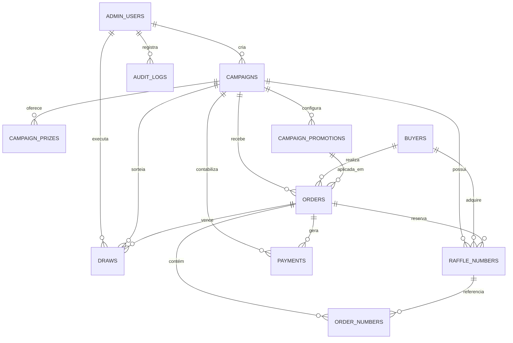
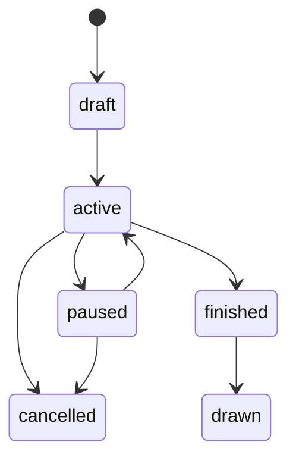
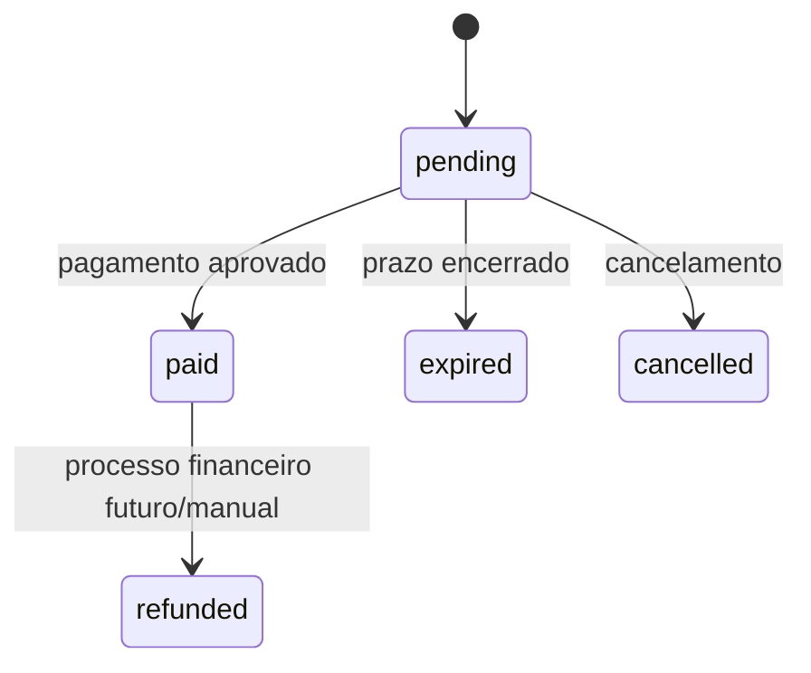
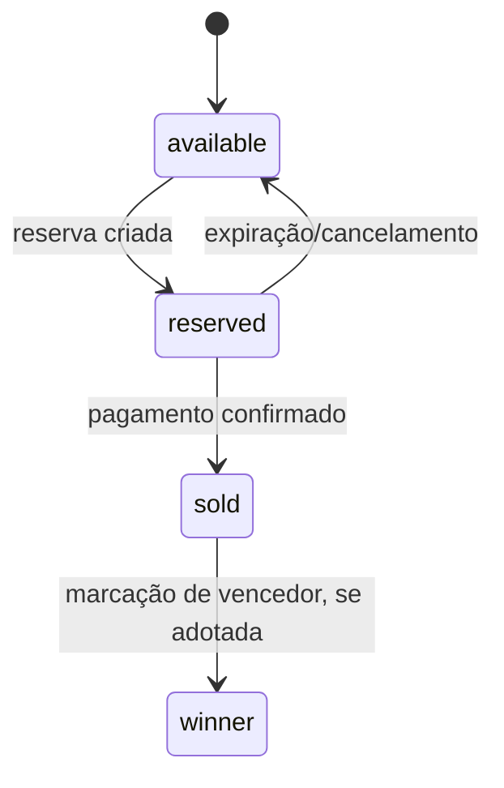

# Arquitetura do Banco de Dados

## 1. Finalidade

O banco PostgreSQL da Lovable Cloud é a fonte de verdade da plataforma. Ele mantém campanhas, compradores, pedidos, números, pagamentos, sorteios, promoções e usuários administrativos. Também concentra as operações que precisam de atomicidade: reserva, confirmação, cancelamento, expiração e cálculo promocional.

Este documento descreve o modelo efetivamente utilizado pelo aplicativo. `supabase/complete_schema.sql` registra a estrutura-base histórica; a fonte evolutiva oficial é a sequência em `supabase/migrations/`.

## 2. Diagrama de entidades



## 3. Catálogo de tabelas

### 3.1 `admin_users`

Autoriza usuários autenticados a operar o painel.

| Campo | Tipo | Regra |
| --- | --- | --- |
| `id` | UUID | Chave primária |
| `auth_user_id` | UUID | Referência ao usuário autenticado; único |
| `name` | texto | Nome administrativo opcional |
| `email` | texto | Obrigatório e único |
| `role` | texto | `super_admin`, `admin` ou `viewer` |
| `created_at` | timestamptz | Data de cadastro |

O código atual considera administrador qualquer sessão com linha correspondente; os valores de `role` estão preparados para uma autorização mais granular futura.

### 3.2 `campaigns`

Entidade central da rifa.

| Grupo | Campos principais |
| --- | --- |
| Identificação | `id`, `name`, `slug` único |
| Conteúdo | `description`, `short_description`, `banner_url` |
| Prêmio | `prize_description`, `prize_image_1`, `prize_image_2` |
| Operação | `status`, `start_date`, `end_date`, `draw_date` |
| Comercial | `number_quantity`, `number_price`, `goal_amount`, `pix_key` |
| Documentos | `regulation_text`, `regulation_url`, `authorization_url`, `drive_folder_url` |
| Auditoria | `created_by`, `created_at`, `updated_at` |

Restrições relevantes:

- `slug` é único.
- `number_quantity` fica entre 100 e 1.000.
- `number_price` deve ser positivo.
- Estados permitidos: `draft`, `active`, `paused`, `finished`, `drawn`, `cancelled`.

### 3.3 `campaign_prizes`

Permite múltiplos prêmios ordenados por campanha.

| Campo | Descrição |
| --- | --- |
| `campaign_id` | Campanha proprietária, com exclusão em cascata |
| `title` | Título obrigatório |
| `description` | Detalhes opcionais |
| `image_url` | Recurso visual |
| `position` | Ordem de apresentação |

### 3.4 `campaign_promotions`

Define preços promocionais por quantidade exata.

| Campo | Regra |
| --- | --- |
| `campaign_id` | FK obrigatória, exclusão em cascata |
| `quantity` | Inteiro maior que 1 |
| `promotional_price` | Valor total positivo da faixa |
| `active` | Controla disponibilidade pública |
| `created_at`, `updated_at` | Auditoria temporal |

A combinação `(campaign_id, quantity)` é única. Uma promoção só vale quando a quantidade selecionada coincide exatamente com `quantity`; não existe composição ou escolha da faixa inferior.

### 3.5 `buyers`

Cadastro mínimo do participante.

| Campo | Descrição |
| --- | --- |
| `name` | Nome do comprador |
| `email` | Opcional |
| `whatsapp` | Obrigatório e único |
| `created_at` | Primeiro cadastro |

Na reserva, `whatsapp` funciona como chave de reconciliação: um comprador recorrente atualiza nome e, quando informado, e-mail.

### 3.6 `orders`

Representa a tentativa de compra e preserva o histórico financeiro.

| Campo | Descrição |
| --- | --- |
| `campaign_id` | Campanha da compra |
| `buyer_id` | Comprador |
| `status` | `pending`, `paid`, `expired`, `cancelled` ou `refunded` |
| `quantity` | Quantidade reservada |
| `list_amount` | Total pelo preço regular no momento da compra |
| `amount` | Total efetivamente cobrado |
| `campaign_promotion_id` | Faixa promocional aplicada, quando houver |
| `seller_name` | Vendedor indicado opcionalmente |
| `pix_qr_code` | QR em base64 |
| `pix_copy_paste` | Código PIX |
| `payment_provider` | Provedor utilizado |
| `payment_provider_id` | Identificador externo |
| `expires_at`, `paid_at` | Datas operacionais |
| `created_at`, `updated_at` | Auditoria temporal |

`amount` não é recalculado durante o checkout. Essa decisão preserva a oferta aplicada e garante que a cobrança corresponda à reserva validada.

### 3.7 `raffle_numbers`

Mantém cada número individual de uma campanha.

| Campo | Descrição |
| --- | --- |
| `campaign_id`, `number` | Identificam unicamente a cota |
| `status` | `available`, `reserved`, `sold`, `cancelled` ou `winner` |
| `current_order_id` | Pedido que reservou/comprou o número |
| `buyer_id` | Comprador associado |
| `reserved_until` | Limite da reserva temporária |
| `sold_at` | Confirmação da venda |

A restrição única `(campaign_id, number)` evita duplicidade. O índice por campanha e estado acelera grade, métricas e seleção de elegíveis.

### 3.8 `order_numbers`

Tabela de ligação e histórico entre pedido e números.

| Campo | Descrição |
| --- | --- |
| `order_id` | Pedido |
| `raffle_number_id` | Registro físico da cota |
| `campaign_id` | Campanha redundante para consulta eficiente |
| `number` | Número preservado no pedido |

### 3.9 `payments`

Histórico de eventos financeiros confirmados.

| Campo | Descrição |
| --- | --- |
| `order_id`, `campaign_id` | Contexto da transação |
| `provider` | Provedor financeiro |
| `provider_payment_id` | ID externo |
| `status`, `amount` | Estado e valor |
| `payload` | Dados complementares em JSONB |
| `confirmed_at`, `created_at` | Datas |

### 3.10 `draws`

Registra o resultado de um sorteio.

| Campo | Descrição |
| --- | --- |
| `campaign_id` | Campanha sorteada |
| `winner_number` | Número vencedor |
| `winner_buyer_id` | Comprador vencedor |
| `winner_order_id` | Pedido vencedor, quando preenchido |
| `eligible_numbers_count` | Universo elegível |
| `draw_method` | Método informado |
| `draw_seed`, `draw_hash` | Campos preparados para auditoria reproduzível |
| `drawn_by`, `drawn_at` | Responsável e data |
| `winner_art_url` | Arte de divulgação opcional |

### 3.11 `audit_logs`

Estrutura destinada ao registro de ações administrativas: ação, entidade, identificador, metadados e responsável. O uso deve ser ampliado quando operações críticas migrarem para funções administrativas centralizadas.

## 4. Estados e transições

### 4.1 Campanha



O banco restringe os valores válidos; a interface oferece ativar, pausar e encerrar. Nem todas as transições são formalizadas por uma função única, portanto a autorização é garantida por RLS, mas a máquina de estados continua sob responsabilidade da aplicação.

### 4.2 Pedido



### 4.3 Número



## 5. Funções e regras transacionais

### 5.1 `is_admin()`

- Retorna se `auth.uid()` possui linha em `admin_users`.
- É `STABLE` e `SECURITY DEFINER` para evitar recursão nas políticas.
- Serve como base das políticas administrativas.

### 5.2 `reserve_numbers(...)`

Fonte de verdade da reserva e do preço.

1. Normaliza e valida quantidade.
2. Rejeita números repetidos.
3. Verifica a existência e o estado ativo da campanha.
4. Bloqueia as linhas selecionadas com `FOR UPDATE`.
5. Aceita apenas números disponíveis ou reservas já vencidas.
6. Calcula `list_amount = round(number_price × quantidade, 2)`.
7. Busca promoção ativa de quantidade exata.
8. Define `amount` como preço promocional ou regular.
9. Insere/atualiza comprador pelo WhatsApp.
10. Cria pedido pendente com expiração de três minutos.
11. Marca os números como reservados.
12. Registra as linhas em `order_numbers`.

Resposta de sucesso:

```json
{
  "ok": true,
  "order_id": "uuid",
  "amount": 50.00,
  "list_amount": 57.00,
  "promotion_id": "uuid-ou-null",
  "expires_at": "timestamp"
}
```

### 5.3 `confirm_payment(order, external_id)`

- Localiza o pedido.
- É idempotente para pedidos já pagos.
- Atualiza pedido para `paid`, define `paid_at` e guarda o identificador externo.
- Move todos os números do pedido para `sold` e remove a expiração.
- É chamada pelo webhook com credencial privilegiada.

### 5.4 `confirm_order_payment(order)`

Fluxo administrativo de confirmação manual. Marca pedido e números como pagos/vendidos e registra pagamento conforme a implementação-base. Deve permanecer restrito a administradores.

### 5.5 `cancel_order(order)`

Cancela o pedido e libera imediatamente as cotas vinculadas. É utilizada por uma função de servidor para evitar expor tabelas privadas ao participante.

### 5.6 `expire_pending_orders()`

- Libera números reservados cujo `reserved_until` passou.
- Marca pedidos pendentes vencidos como `expired`.
- Retorna a quantidade de números liberados.

A função precisa ser acionada por processo agendado ou fluxo operacional; sua simples existência não executa limpeza automaticamente.

### 5.7 `get_seller_ranking(campaign)`

Agrega somente pedidos pagos com vendedor válido. Retorna nome do vendedor, números vendidos e total arrecadado, ordenado por desempenho e limitado a 50 linhas. Como não retorna comprador, telefone ou pedido, é adequada à página pública.

### 5.8 `seed_raffle_numbers()`

Gatilho `AFTER INSERT` de `campaigns`. Cria de 1 até `number_quantity`, todos com estado `available`.

### 5.9 `set_campaign_promotion_updated_at()`

Gatilho `BEFORE UPDATE` que mantém a data de alteração das faixas promocionais.

## 6. Segurança e controle de acesso

### 6.1 Modelo de papéis

- `anon`: visitante sem sessão.
- `authenticated`: usuário autenticado; as políticas ainda verificam `is_admin()` para gestão.
- `service_role`: servidor confiável; ignora RLS e deve ser usado somente em módulos server-side.

### 6.2 Matriz conceitual

| Recurso | Público | Administrador | Servidor privilegiado |
| --- | --- | --- | --- |
| Campanhas visíveis | Leitura | CRUD | Total |
| Prêmios | Leitura | CRUD | Total |
| Promoções ativas | Leitura | CRUD | Total |
| Número + estado | Leitura | CRUD | Total |
| Dados do comprador | Sem leitura direta | Leitura/gestão | Total |
| Pedidos | Sem leitura direta | Leitura/gestão | Total |
| Relação pedido-número | Sem leitura direta | Leitura/gestão | Total |
| Pagamentos | Sem leitura direta | Leitura/gestão | Total |
| Sorteios | Leitura controlada | CRUD | Total |
| Logs | Sem acesso | Gestão | Total |

### 6.3 Proteção de dados pessoais

- `buyers`, `orders`, `order_numbers` e `payments` não são fontes públicas.
- `raffle_numbers` deve expor ao visitante somente número e estado, nunca comprador ou pedido atual.
- `campaigns.pix_key` não deve fazer parte da projeção pública.
- `draws.winner_buyer_id` não deve ser exposto a visitantes quando não for necessário.
- `getOrderPublic` consulta com credencial de servidor, mas devolve uma lista fechada de campos apropriados ao titular do link.
- `get_seller_ranking` agrega por vendedor e não retorna dados do comprador.

### 6.4 Funções `SECURITY DEFINER`

São justificadas para operações públicas que precisam atravessar RLS, mas devem:

- fixar `search_path = public`;
- validar integralmente as entradas;
- limitar a operação ao caso de uso declarado;
- evitar SQL dinâmico baseado em entrada do usuário;
- conceder `EXECUTE` apenas aos papéis necessários;
- retornar dados mínimos.

## 7. Realtime

A publicação inclui `raffle_numbers`, `orders` e `payments`. A página da campanha assina alterações em `raffle_numbers` filtradas por campanha. O painel da campanha acompanha números e pedidos para atualizar indicadores e relatórios.

Realtime melhora a experiência, mas não substitui o bloqueio transacional da reserva.

## 8. Storage

O bucket `banners-reviva` armazena banners e imagens de campanha. As políticas históricas permitem leitura pública ou por URL assinada, e escrita administrativa. O componente `ImageUpload` grava arquivos em pastas lógicas e devolve uma URL assinada.

Recomendações operacionais:

- validar tipo MIME e tamanho no bucket;
- usar nomes aleatórios, como já feito pelo componente;
- restringir escrita a administradores;
- não armazenar documentos pessoais no bucket público;
- preferir persistir o caminho do objeto e gerar URLs quando necessário, evitando URLs assinadas de longa duração como dado definitivo.

## 9. Índices e integridade

Índices relevantes identificados:

- `campaigns(status)` para listagem pública/administrativa.
- `campaigns(slug)` para abertura da campanha.
- `orders(campaign_id)` e `orders(status)` para relatórios e processamento.
- `raffle_numbers(campaign_id, status)` para grade e elegibilidade.
- `campaign_promotions(campaign_id, active, quantity)` para cálculo da faixa.

Restrições únicas relevantes:

- campanha por `slug`;
- comprador por `whatsapp`;
- número por campanha;
- promoção por campanha e quantidade;
- usuário autenticado por linha administrativa.

## 10. Estratégia de migrações

- Novas alterações entram em arquivos cronológicos em `supabase/migrations/`.
- Migrações aplicadas são imutáveis; correções devem ser novas migrações.
- `docs/migrations/` contém cópias iniciais e não substitui o diretório oficial.
- `complete_schema.sql` ajuda na leitura da base original, porém não contém necessariamente as evoluções mais recentes, como promoções.
- Após migração, atualizar os tipos gerados usados em `src/integrations/supabase/types.ts`.

### Modelo obrigatório para nova tabela

```sql
CREATE TABLE public.exemplo (...);

GRANT SELECT, INSERT, UPDATE, DELETE ON public.exemplo TO authenticated;
GRANT ALL ON public.exemplo TO service_role;

ALTER TABLE public.exemplo ENABLE ROW LEVEL SECURITY;

CREATE POLICY "exemplo admin"
ON public.exemplo
FOR ALL TO authenticated
USING (public.is_admin())
WITH CHECK (public.is_admin());
```

Adicione acesso `anon` somente quando houver um caso público real e uma política igualmente limitada.

## 11. Backup, restauração e operação

- Exportações devem ser geradas pelas configurações avançadas da Lovable Cloud.
- Antes de migrações destrutivas, gerar backup e validar a restauração.
- Não executar alterações manuais sem reproduzi-las em uma migração versionada.
- Monitorar volume de pedidos pendentes e reservas expiradas.
- Conciliar periodicamente pedidos pagos com o provedor.
- Preservar `orders.amount` e `list_amount` em relatórios financeiros; não inferir vendas antigas a partir do preço atual da campanha.

## 12. Consultas de diagnóstico

As consultas abaixo são exemplos para manutenção autorizada e não devem ser expostas na aplicação pública.

### Reservas vencidas ainda ativas

```sql
SELECT campaign_id, number, current_order_id, reserved_until
FROM public.raffle_numbers
WHERE status = 'reserved'
  AND reserved_until < now();
```

### Integridade entre pedidos pagos e números

```sql
SELECT o.id, o.status, count(onum.id) AS linked_numbers, o.quantity
FROM public.orders o
LEFT JOIN public.order_numbers onum ON onum.order_id = o.id
WHERE o.status = 'paid'
GROUP BY o.id, o.status, o.quantity
HAVING count(onum.id) <> o.quantity;
```

### Conferência de promoção aplicada

```sql
SELECT id, campaign_id, quantity, list_amount, amount, campaign_promotion_id
FROM public.orders
WHERE campaign_promotion_id IS NOT NULL
  AND amount >= list_amount;
```

O resultado esperado da última consulta é vazio.

## 13. Checklist de revisão de schema

- [ ] Toda tabela nova possui chave primária e FKs coerentes.
- [ ] Toda tabela pública possui `GRANT` explícito.
- [ ] RLS está habilitada.
- [ ] Políticas separam visitante, administrador e servidor.
- [ ] Colunas sensíveis não aparecem em projeções públicas.
- [ ] Funções privilegiadas fixam `search_path`.
- [ ] Entradas públicas são validadas e operações são atômicas.
- [ ] Índices suportam filtros e junções principais.
- [ ] Tipos TypeScript foram regenerados.
- [ ] A migração foi testada em ambiente não produtivo.
